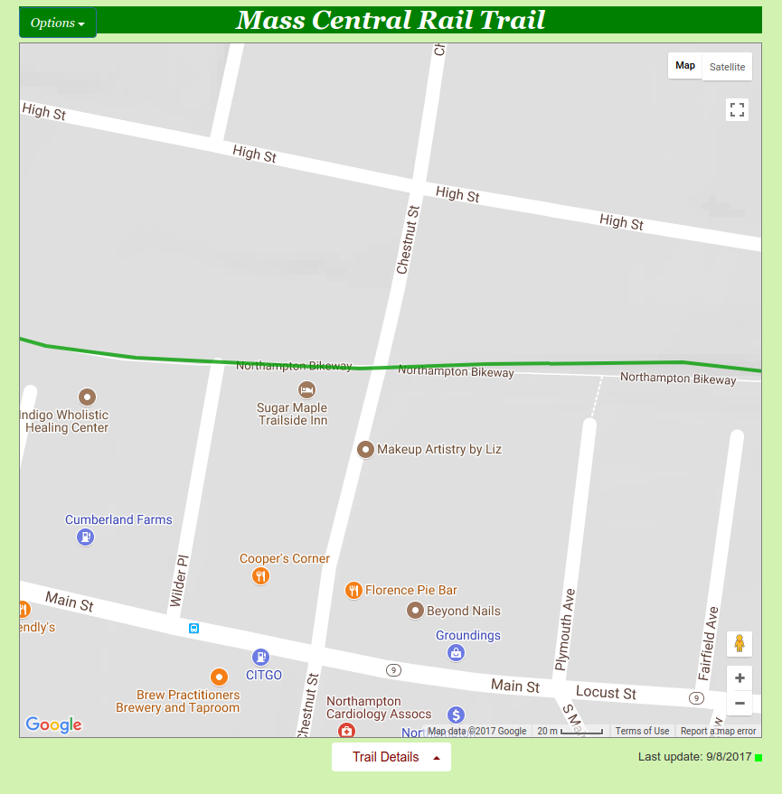
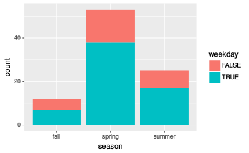

Homework 1
==========

> Your first major assignment is a set of exercises based around a single dataset called rail_trail, which will provide you with practice in creating visualizations using R and ggplot2.

Due: Month, Day Year @ Time

-   [Instructions](#instructions)
-   [The rail trail dataset](#the-rail-trail-dataset)
-   [How to describe your visualizations](#how-to-describe-your-visualizations)
-   [Questions](#questions)
-   [How to submit](#how-to-submit)
-   [Cheatsheets](#cheatsheets)

Instructions
------------

Use the R Markdown file `homework_1.Rmd` to do your work when completing the questions below. Be sure to save, commit, and push (upload) frequently to Github so that you have incremental snapshots of your work. When you're done, follow the [**How to submit** section](#how-to-submit) below to setup a Pull Request, which will be used for feedback.

-   Remember that the point of us using RMarkdown documents is to combine code and writeups! Each block of R code should have some sort of explanation or justification using full sentences.

-   **Your grade will take into account your code, your explanations, and whether your document looks nice when "knitted" to HTML or PDF**.

The rail trail dataset
----------------------


For this homework assignment, you will be working though a set of visualization problems based on the `rail_trail` dataset. The `rail_trail` dataset was collected by the Pioneer Valley Planning Commission (PVPC) and counts the number of people that walked through a sensor on a *rail trail* during a ninety day period. [A *rail trail* is a retired or abandoned railway that was converted into a walking trail](https://wikipedia.org/wiki/Rail_trail). The data was collected from April 5, 2005 to November 15, 2005 using a laser sensor placed at a location north of Chestnut Street in Florence, MA.



The dataset contains the following variables:

<table>
<colgroup>
<col width="16%" />
<col width="83%" />
</colgroup>
<thead>
<tr class="header">
<th align="left">Variable</th>
<th align="left">Description</th>
</tr>
</thead>
<tbody>
<tr class="odd">
<td align="left"><code>hightemp</code></td>
<td align="left">daily high temperature (in degrees Fahrenheit)</td>
</tr>
<tr class="even">
<td align="left"><code>lowtemp</code></td>
<td align="left">daily low temperature (in degrees Fahrenheit)</td>
</tr>
<tr class="odd">
<td align="left"><code>avgtemp</code></td>
<td align="left">average of daily low and daily high temperature (in degrees Fahrenheit)</td>
</tr>
<tr class="even">
<td align="left"><code>season</code></td>
<td align="left">indicates whether the season was Spring, Summer, or Fall</td>
</tr>
<tr class="odd">
<td align="left"><code>cloudcover</code></td>
<td align="left">measure of cloud cover (in oktas)</td>
</tr>
<tr class="even">
<td align="left"><code>precip</code></td>
<td align="left">measure of precipitation (in inches)</td>
</tr>
<tr class="odd">
<td align="left"><code>volume</code></td>
<td align="left">estimated number of trail users that day (number of breaks recorded)</td>
</tr>
<tr class="even">
<td align="left"><code>weekday</code></td>
<td align="left">indicator of whether the day was a non-holiday weekday</td>
</tr>
</tbody>
</table>

How to describe your visualizations
-----------------------------------

When describing the contents of a visualization, follow the ideas discussed in these resources:

-   *Describing univariate and bivariate data*: <http://summer.cds101.com/materials/describing-univariate-and-bivariate-data/>

-   *Introduction to data and visualization I* slides: <http://summer18.cds101.com/doc/class04_slides.pdf>

-   *Introduction to data and visualization II* slides: <http://summer18.cds101.com/doc/class05_slides.pdf>

Questions
---------

1.  In the `rail_trail` dataset, how many rows are there? How many columns? Which variables in the dataset are continuous/numerical and which are categorical?

2.  Create a histogram of the variable `volume` using the following code:

    ``` r
    ggplot(data = rail_trail) +
      geom_histogram(mapping = aes(x = volume))
    ```

    Describe the *shape* and *center* of the distribution. Afterward, try adjusting the size of the histogram bins by adding the `binwidth` input. To start with, use `binwidth = 21`. If you need help with where to place `binwidth`, read the documentation by running `?geom_histogram` in your *Console* window. Then, find a binwidth that's too narrow and another one that's too wide to produce a meaningful histogram.

3.  Create a histogram for each of the remaining numerical variables, and describe the *shape* and *center* of each distribution. Are there any distributions that are similar in *shape* to each other?

4.  Use `geom_point()` to create a scatterplot that plots `weekday` versus `season`. Why is this plot not useful?

5.  Create a `geom_count()` plot (an alternative to a mosaic plot) using the same variables you considered in question 4:

    ``` r
    ggplot(data = rail_trail) +
      geom_count(mapping = aes(x = season, y = weekday))
    ```

    Which circle in the plot takes up the most area? Explain the meaning of the different size circles in the plot and what information it contains that is missing in the previous scatter plot.

6.  Run `?geom_bar` in the *Console* window and read the documentation for `geom_bar()`, and then look at the entry for it on the [ggplot2 cheatsheet](http://summer18.cds101.com/doc/ggplot2-cheatsheet.pdf) Use `geom_bar()` to reproduce the following bar chart:

    

    After reproducing the plot, explain what the height of each bar means.

7.  Starting from the code snippet you deduced in question 6, create two more bar charts:

    -   Create a bar chart by supplying the input `position = "dodge"` to `geom_bar()`

    -   Create a bar chart by supplying the input `position = "fill"` to `geom_bar()`.

    After creating the visualizations, describe the feature that `position` controls.

8.  Create a bar chart that maps its aesthetic `aes()` to `precip > 0`. Interpret what this bar chart means.

9.  Create a scatter plot of `volume` versus `hightemp` using `geom_point()`. Describe any trends that you see.

10. Take the code snippet you wrote for question 9 and map the `weekday` variable to `color`. Then create a second plot where, instead of mapping `weekday` to `color`, you *facet* over `weekday` using either `facet_wrap()` or `facet_grid()`. Discuss the advantages and disadvantages to faceting instead of mapping to the `color` aesthetic. How might the balance change if you had a larger dataset?

11. Take the code snippet that you wrote down in question 10 that faceted over `weekday` and create a model for each facet panel using `geom_smooth()`. Discuss the trends in the number of rail trail users that `geom_smooth()` picks up.

12. Copy the code snippet you deduced in question 11 and use the input `se = FALSE` for `geom_smooth()`. What does the `se` input option for `geom_smooth()` control?

How to submit
-------------

When you are ready to submit, be sure to save, commit, and push your final result so that everything is synchronized to Github. Then, navigate to **your copy** of the Github repository you used for this assignment. You should see your repository, along with the updated files that you just synchronized to Github. Confirm that your files are up-to-date, and then do the following steps:

1.  Click the *Pull Requests* tab near the top of the page.
2.  Click the green button that says "New pull request".
3.  Click the dropdown menu button labeled "base:", and select the option `grading`.
4.  Confirm that the dropdown menu button labled "compare:" is set to `master`.
5.  Click the green button that says "Create pull request".
6.  Give the *pull request* the following title: `Submission: Homework 1, FirstName LastName`, replacing `FirstName` and `LastName` with your actual first and last name.
7.  In the messagebox, write `My homework 1 submission is ready for grading @instructor-username`.
8.  Click "Create pull request" to lock in your submission.

Cheatsheets
-----------

You are encouraged to review and keep the following cheatsheets handy while working on this assignment:

-   [RStudio cheatsheet](http://summer18.cds101.com/doc/rstudio-IDE-cheatsheet.pdf)
-   [RMarkdown cheatsheet](http://summer18.cds101.com/doc/rmarkdown-cheatsheet.pdf)
-   [RMarkdown reference](http://summer18.cds101.com/doc/rmarkdown-reference.pdf)
-   [`ggplot2` cheatsheet](http://summer18.cds101.com/doc/ggplot2-cheatsheet.pdf)
